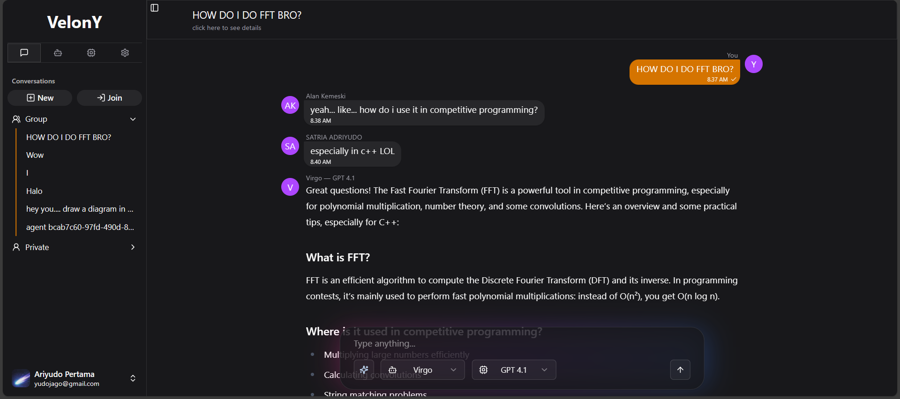

# VelonY

*Build, share, and chat with custom AI agents*

VelonY is an extensible chatbot platform supporting both private and group conversations with multiple agents. Users can create custom agents/models, explore and subscribe to others' creations, and interact in real-time across desktop and mobile devices. Built with a modern stack—Next.js, Fastify, Supabase, and ShadCN—VelonY offers flexibility and a seamless user experience.

## Live Demo

Try it here: [https://velony.vercel.app](https://velony.vercel.app)

## Features

- **Multi-agent private chats**  
  Chat with multiple bots in a private convo.
  
  

- **Group conversations with friends + bots**  
  Invite friends and have bots join the same room.
  
  

- **Build custom agents & models**  
  Fully customizable agent and model creation.
  
  
  

- **Discover community creations**  
  Browse public agents/models on the explore page.
  
  

- **Fully responsive design**  
  Works seamlessly on desktop, tablet, and mobile devices.
  
  

## Concepts

- **Agent**: A persona or identity with its own name, and behavior. Agents are the front-facing interface users interact with.
- **Model**: A backend LLM configuration powering an agent's responses. Think of it as an LLM endpoint (like OpenAI, DeepSeek, etc.) with specific settings (e.g., temperature, top_p).

## Tech Stack

- **Frontend:** Next.js (TypeScript), ShadCN UI
- **Backend:** Fastify (JavaScript)
- **Authentication:** Google OAuth2 via GCP
- **Database:** Supabase
- **Realtime:** Pusher or Socket.io
- **Cache (session/auth):** Redis

## Author

Made with sweat and blood by **Yudo**

## License

Licensed under the [MIT License](./LICENSE)
